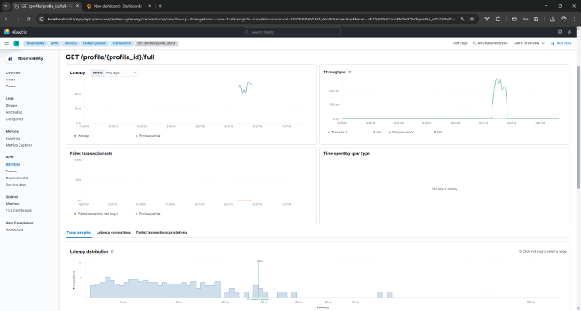
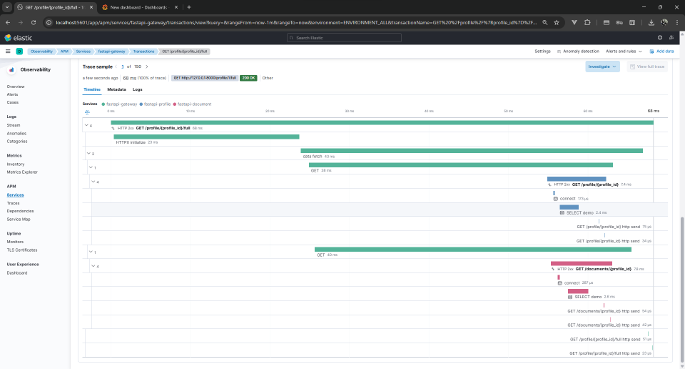
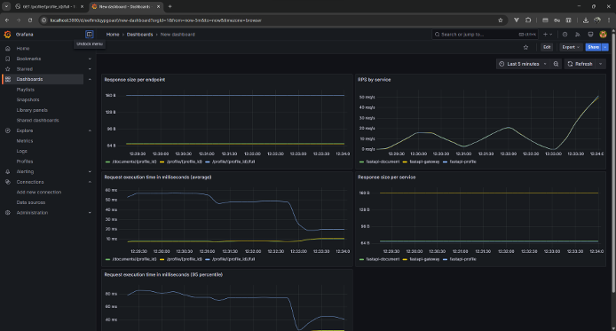

# OpenTelemetry. How to.

Этот проект демонстрирует пример инструментации FastAPI приложения с подключенными трейсингом, метриками и сквозными логами. Вся инфраструктура настроена.


### Архитектура


### Что внутри?

Внутри 3 сервиса
1. API Gateway. Собирает данные из двух других сервисов.
2. Сервис документов
3. Сервис профилей

### Как это выглядит?
##### Elastic APM, конкретная транзакция

##### Elastic APM, конкретный трейс. Видны межсервисные запросы.

##### Метрики Grafana, полученные из OpenTelemetry (OTel)


### Запуск проекта
#### Поднимаем OTel инфру
```bash
docker compose up -d --build
```

#### Настраиваем БД для бэкендов
```bash
docker run --name otel-postgres -e POSTGRES_PASSWORD=mysecretpassword -v $(pwd)/migrations.sql:/project/migrations.sql -p 5432:5432 -d postgres # Поднимаем БД для бэкендов
docker exec otel-postgres psql -U postgres -c "CREATE DATABASE demo;" # Создаем БД
docker exec -it otel-postgres bash
cd /project
psql --user postgres < migrations.sql # Накатываем схему БД
```

#### Ставим зависимости
```bash
uv venv .venv
source .venv/bin/activate
uv sync
```
или
```bash
python -m venv .venv
source .venv/bin/activate
pip install -r requirements.txt
```

#### Запускаем приложение
```bash
uvicorn document_service:app
uvicorn profile_service:app
uvicorn api_gateway:app
```
