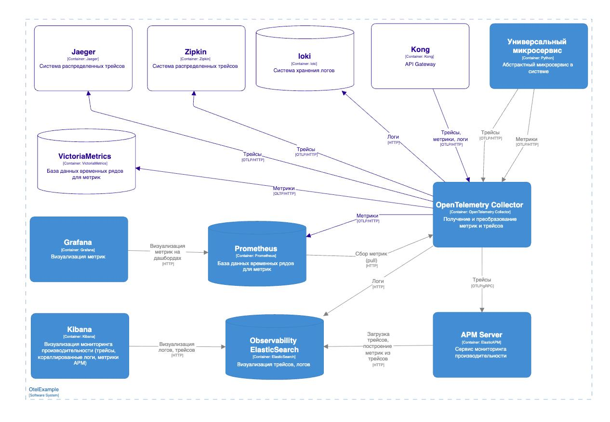

# OpenTelemetry. How to.

Этот проект демонстрирует пример инструментации FastAPI приложения с подключенными трейсингом, метриками и сквозными логами. Вся инфраструктура настроена.

### Запуск проекта
```bash
uvicorn main:app
```

### Архитектура

